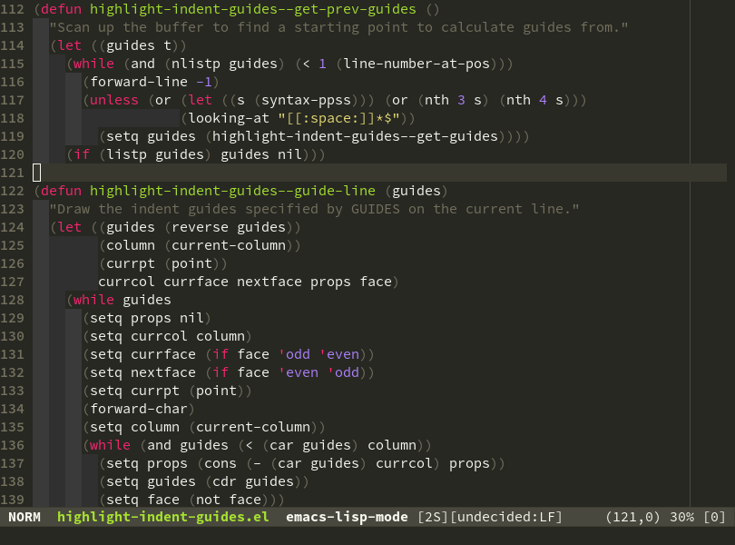
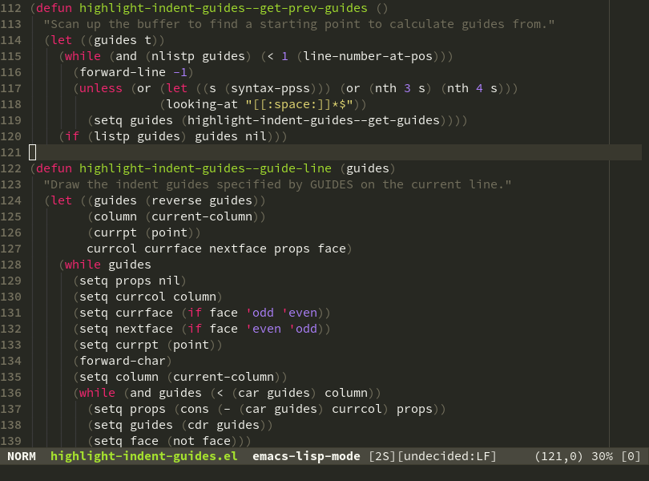

highlight-indent-guides.el
==========================

This minor mode highlights indentation levels via `font-lock`. Indent widths are
dynamically discovered, which means this correctly highlights in any mode,
regardless of indent width, even in languages with non-uniform indentation such
as Haskell. By default, this mode also inspects your theme dynamically, and
automatically chooses appropriate colors for highlighting. This mode works
properly around hard tabs and mixed indentation, and it behaves well in large
buffers.

Screenshots
-----------

`(setq highlight-indent-guides-method 'fill)`

`(setq highlight-indent-guides-method 'column)`

`(setq highlight-indent-guides-method 'character)`

Installation
------------

To install from [Melpa](http://melpa.org/#/getting-started), use <kbd>M-x
package-install RET highlight-indent-guides RET</kbd>. Otherwise, download
`highlight-indent-guides.el` and put it in your load path.

Usage
-----

Require it:

`(require 'highlight-indent-guides)`

Then, do <kbd>M-x highlight-indent-guides-mode</kbd> to enable it. To enable it
automatically in most programming modes, use the following:

`(add-hook 'prog-mode-hook 'highlight-indent-guides-mode)`

Configuration
-------------

This mode supports three display methods. To change the display method,
customize `highlight-indent-guides-method`, and set it to one of the following:
- `fill`: The default method. All whitespace used for indentation is
  highlighted. The color of each level of indentation alternates between
  `highlight-indent-guides-odd-face` and `highlight-indent-guides-even-face`.
- `column`: Like `fill`, but only the first column of each level of indentation
  is highlighted.
- `character`: The first column of each level of indentation is drawn using a
  column of characters. The character to draw with is specified by
  `highlight-indent-guides-character`, and it is drawn using the face
  `highlight-indent-guides-character-face`.

By default, this mode dynamically chooses colors that look acceptable with the
loaded theme. It does this by altering the luminosity of the theme's background
color by a given percentage. These percentages can be tweaked, to make the
colors more intense or subtle.

For example:

`(setq highlight-indent-guides-auto-odd-face-perc 15)`

`(setq highlight-indent-guides-auto-even-face-perc 15)`

`(setq highlight-indent-guides-auto-character-face-perc 20)`

To set the colors manually, this feature must be disabled:

`(setq highlight-indent-guides-auto-enabled nil)`

To change the colors used for highlighting in the `fill` or `column` methods,
customize `highlight-indent-guides-odd-face` and
`highlight-indent-guides-even-face`.

For example:

`(set-face-background 'highlight-indent-guides-odd-face "darkgray")`

`(set-face-background 'highlight-indent-guides-even-face "dimgray")`

To change the display of the indent guides in the `character` method, customize
`highlight-indent-guides-character` and
`highlight-indent-guides-character-face`.

For example:

`(setq highlight-indent-guides-character ?\|)`

`(set-face-foreground 'highlight-indent-guides-character-face "darkgray")`

Limitations
-----------

To display the `character` method guides, and to highlight tab characters
correctly, this mode controls the `display` text property of some characters via
`font-lock`. Therefore, this mode may or may not play well with other modes that
use the `display` text property. This mode may also interfere with modes that
use a display table to modify how whitespace is drawn, e.g., the `whitespace`
minor mode.

Alternatives
------------

Package Name                    | Widths  | Hard Tabs   | Other Notes
--------------------------------|---------|-------------|---------------------
[highlight-indentation.el][1]   | Fixed   | Unsupported | Very popular
[indent-guide.el][2]            | Dynamic | Supported   | Fairly slow, jittery
[hl-indent.el][3]               | Dynamic | Unsupported | Slow for large files
[visual-indentation-mode.el][4] | Fixed   | Unsupported | Fast and slim

[1]: https://github.com/antonj/Highlight-Indentation-for-Emacs
[2]: https://github.com/zk-phi/indent-guide
[3]: https://github.com/ikirill/hl-indent
[4]: https://github.com/skeeto/visual-indentation-mode
