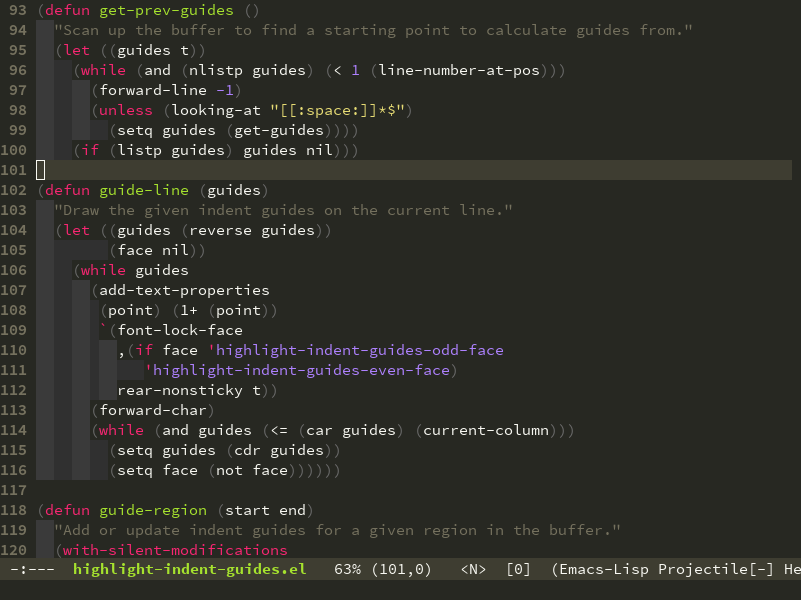

highlight-indent-guides.el
==========================

This minor mode highlights indentation levels using a pair of alternating faces.
Indent widths are dynamically discovered, which means this correctly highlights
in any mode, regardless of indent width, even in languages with non-uniform
indentation such as Haskell. This mode works properly around hard tabs and mixed
indentation, and it behaves well in large buffers.

Screenshot
----------

Installation
------------

To install from [Melpa](http://melpa.org/#/getting-started), use <kbd>M-x
package-install RET highlight-indent-guides RET</kbd>. Otherwise, download
`highlight-indent-guides.el` and put it in your load path.

Usage
-----

Require it:

`(require 'highlight-indent-guides)`

Then, do <kbd>M-x highlight-indent-guides-mode</kbd> to enable it. To enable it
automatically in most programming modes, use the following:

`(add-hook 'prog-mode-hook 'highlight-indent-guides-mode)`

Configuration
-------------

To change the colors used for highlighting, customize
`highlight-indent-guides-odd-face` and `highlight-indent-guides-even-face`.

For example:

`(set-face-background 'highlight-indent-guides-odd-face "darkgray")`

`(set-face-background 'highlight-indent-guides-even-face "dimgray")`

Alternatives
------------

Package Name                    | Widths  | Hard Tabs   | Other Notes
--------------------------------|---------|-------------|---------------------
[highlight-indentation.el][1]   | Fixed   | Unsupported | Very popular
[indent-guide.el][2]            | Dynamic | Supported   | Fairly slow, jittery
[hl-indent.el][3]               | Dynamic | Unsupported | Slow for large files
[visual-indentation-mode.el][4] | Fixed   | Unsupported | Fast and slim

[1]: https://github.com/antonj/Highlight-Indentation-for-Emacs
[2]: https://github.com/zk-phi/indent-guide
[3]: https://github.com/ikirill/hl-indent
[4]: https://github.com/skeeto/visual-indentation-mode
